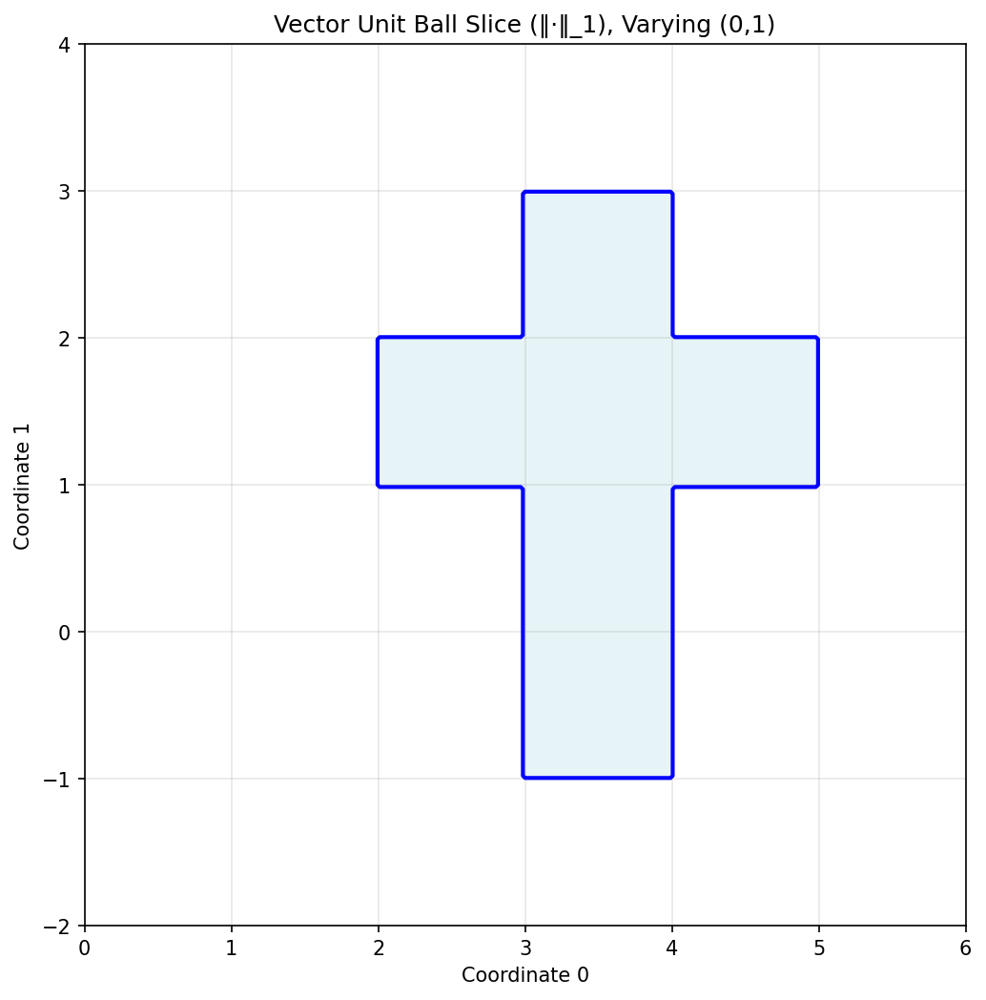
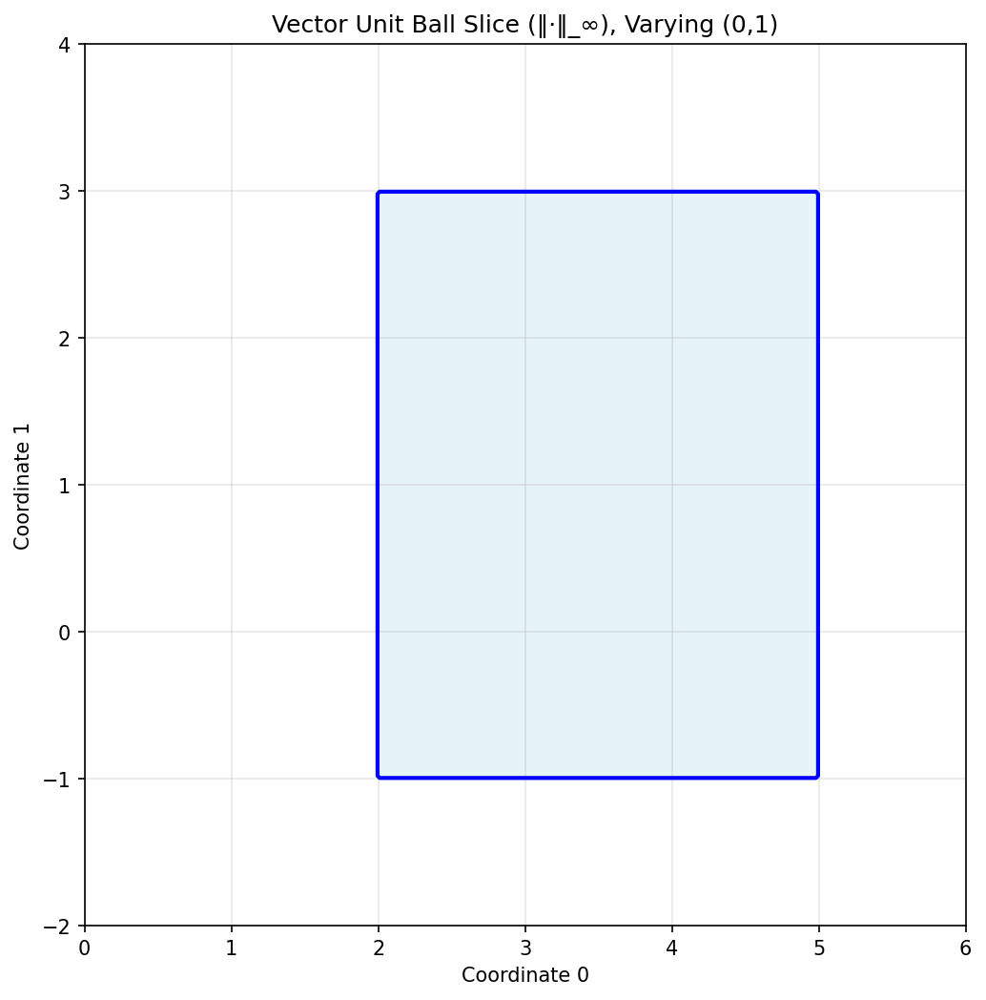
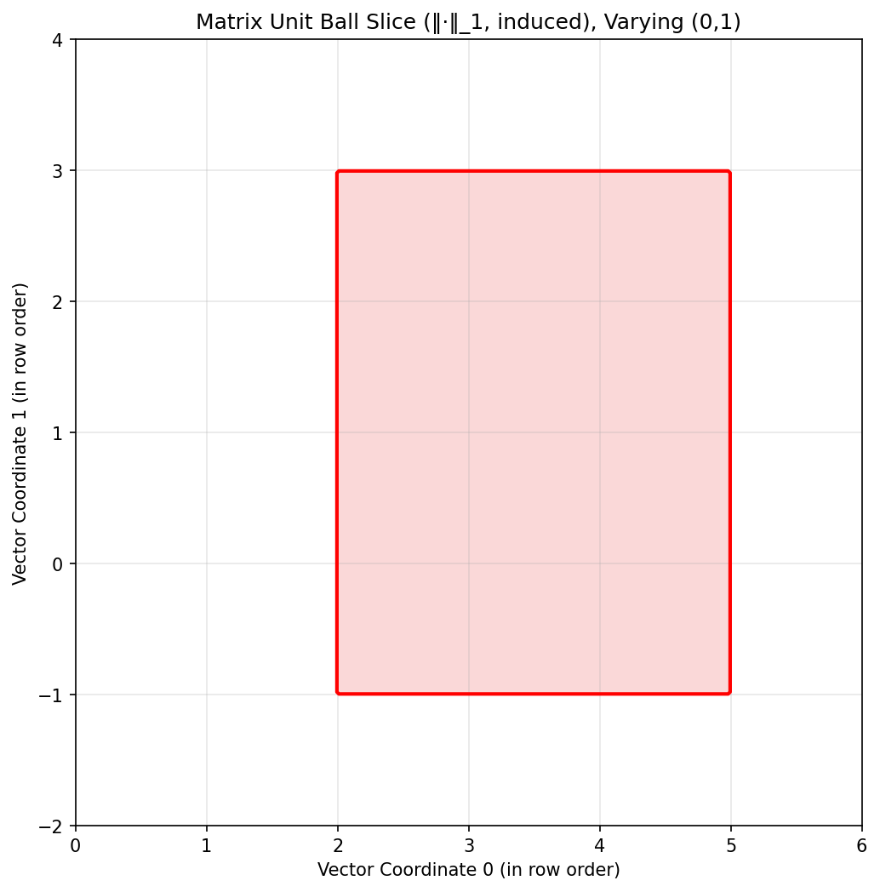
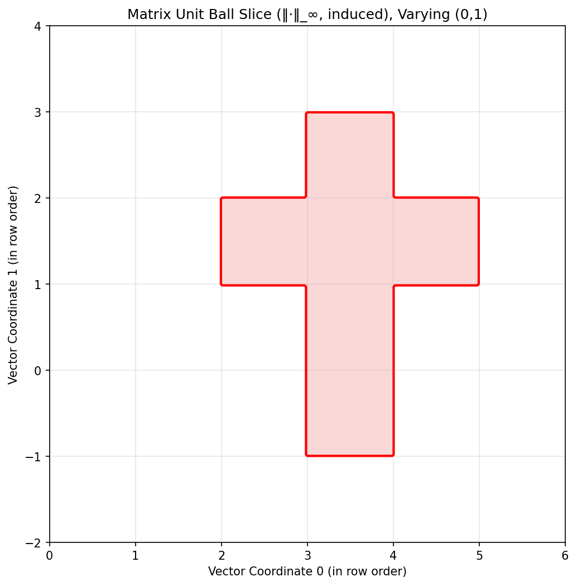

# Vector and Matrix Norms: 1-Norm and Infinity-Norm Analysis

**Author:** Sandro Tozashvili 
**Date:** 03.11.2025

## Introduction

This work implements and visualizes two fundamental vector norms—the 1-norm (Manhattan norm) and the infinity-norm (maximum norm)—along with their induced matrix norms. These norms provide different geometric interpretations of distance and magnitude in vector and matrix spaces.

## Norm Definitions

### Vector Norms

For a vector $x \in \mathbb{R}^4$, we define:

- **1-norm**: $\|x\|_1 = \sum_{i=1}^4 |x_i|$ (sum of absolute values)
  - Implemented in `src/norms.py` as `norm1_vec(x: np.ndarray) -> float`
- **Infinity-norm**: $\|x\|_\infty = \max_{i} |x_i|$ (maximum absolute value)
  - Implemented in `src/norms.py` as `norminf_vec(x: np.ndarray) -> float`

### Induced Matrix Norms

For a $2 \times 2$ matrix $A$, the induced norms are:

- **1-norm (induced)**: $\|A\|_1 = \max_j \sum_i |a_{ij}|$ (maximum column sum of absolute values)
  - Implemented in `src/norms.py` as `norm1_mat(A: np.ndarray) -> float`
- **Infinity-norm (induced)**: $\|A\|_\infty = \max_i \sum_j |a_{ij}|$ (maximum row sum of absolute values)
  - Implemented in `src/norms.py` as `norminf_mat(A: np.ndarray) -> float`

These matrix norms are *induced* by the corresponding vector norms, meaning they measure the maximum "amplification" when the matrix acts on unit vectors.

## Methodology

Two random 4-vectors were generated using a deterministic random number generator (seed = 0) via `two_random_vec4s()` in `src/utils.py`, producing:

```
x = [1, 2, -2, -1]
y = [0, -1, 3, 2]
```

These vectors were reshaped into $2 \times 2$ matrices using row-major order via `vec4_to_mat2x2()` in `src/reshape.py`:

$$
X = \begin{bmatrix} 1 & 2 \\ -2 & -1 \end{bmatrix}, \quad
Y = \begin{bmatrix} 0 & -1 \\ 3 & 2 \end{bmatrix}
$$

## Results

### Distance Calculations

Distances between vectors and matrices were computed using the difference norm via `vector_distance()` and `matrix_distance()` in `src/distances.py`:

| Type | Norm | Distance | Implementation |
|------|------|----------|----------------|
| Vector | $\|\cdot\|_1$ | $\|x - y\|_1 = 8.000000$ | `vector_distance(x, y, "1")` |
| Vector | $\|\cdot\|_\infty$ | $\|x - y\|_\infty = 5.000000$ | `vector_distance(x, y, "inf")` |
| Matrix | $\|\cdot\|_1$ (induced) | $\|X - Y\|_1 = 5.000000$ | `matrix_distance(X, Y, "1")` |
| Matrix | $\|\cdot\|_\infty$ (induced) | $\|X - Y\|_\infty = 7.000000$ | `matrix_distance(X, Y, "inf")` |

### Unit Ball Visualizations

Figure 1 shows 2D slices of the unit balls centered at the reference vectors and matrices, varying coordinates (0,1) while fixing coordinates (2,3) at their reference values. These visualizations were generated using:
- `plot_vector_unit_ball_slice()` in `src/unit_ball.py` for vector unit balls
- `plot_matrix_unit_ball_slice()` in `src/unit_ball.py` for matrix unit balls (using induced norms)

The visualization functions evaluate membership in the unit ball by testing $\|z - x_r\| \leq 1$ (for vectors) or $\|Z - X_r\| \leq 1$ (for matrices) at each grid point, where the grid spans coordinates (0,1) in the 2D slice.









## Discussion

The geometric differences between norms are clearly visible in the unit ball slices. The 1-norm unit ball forms a **diamond** (rotated square) in the 2D slice, as points equidistant from the center under the 1-norm lie on lines parallel to the coordinate axes. The infinity-norm unit ball forms a **square** aligned with the axes, since the maximum coordinate determines distance.

For matrices, the induced norms inherit these geometric properties but applied to the 4D space of $2 \times 2$ matrices (viewed as 4-vectors via the reshaping functions in `src/reshape.py`). The induced 1-norm corresponds to the maximum column sum (computed in `norm1_mat()` by summing absolute values along axis 0) because it measures the maximum amplification when multiplying by a standard basis vector (which has 1-norm = 1). Similarly, the induced infinity-norm equals the maximum row sum (computed in `norminf_mat()` by summing absolute values along axis 1), as it maximizes amplification over all unit vectors under the infinity-norm. These relationships are fundamental to understanding matrix conditioning and stability in numerical linear algebra.

## Implementation Notes

All code is organized in the `src/` directory:
- **`norms.py`**: Core norm implementations (`norm1_vec`, `norminf_vec`, `norm1_mat`, `norminf_mat`)
- **`distances.py`**: Distance calculations using norms of differences (`vector_distance`, `matrix_distance`)
- **`reshape.py`**: Vector-matrix conversion with row/column-major support (`vec4_to_mat2x2`, `mat2x2_to_vec4`)
- **`unit_ball.py`**: Unit ball visualization with grid-based membership testing (`plot_vector_unit_ball_slice`, `plot_matrix_unit_ball_slice`)
- **`utils.py`**: Deterministic random number generation (`rng`, `two_random_vec4s`)
- **`main.py`**: CLI entry point that orchestrates computation and visualization

The main script (`src/main.py`) generates random vectors, computes distances, and produces all visualizations in a single run.

